# Peta Perjalanan Aplikasi Kopkaryapi

## Clean Service System — Sistem Manajemen Layanan Kebersihan Digital

**Periode:** November 2025 — Sekarang
**Website:** https://css.kopkaryapi.id

---

## 1. Tentang Aplikasi

**E-Clean** adalah sistem manajemen layanan kebersihan berbasis web (dan akan diperluas ke mobile) yang menghubungkan beberapa aktor utama:

- **Petugas Kebersihan** — pelaporan kegiatan di lapangan
- **Supervisor** — monitoring & evaluasi kinerja petugas
- **Pengurus / Manajemen** — pelaporan bulanan & pengambilan keputusan
- **Tamu / Pengunjung** — pengiriman keluhan via QR Code

> **Visi ke depan:** memperluas cakupan aplikasi menjadi platform manajemen petugas lapangan secara menyeluruh — meliputi **Satpam / Security**, **Petugas Toko**, dan **Office Boy** — dengan tetap menggunakan pondasi yang sama (QR Code, watermark camera, jadwal, laporan kegiatan, dan notifikasi WhatsApp).

*Screenshot: Halaman Login / Landing Page*

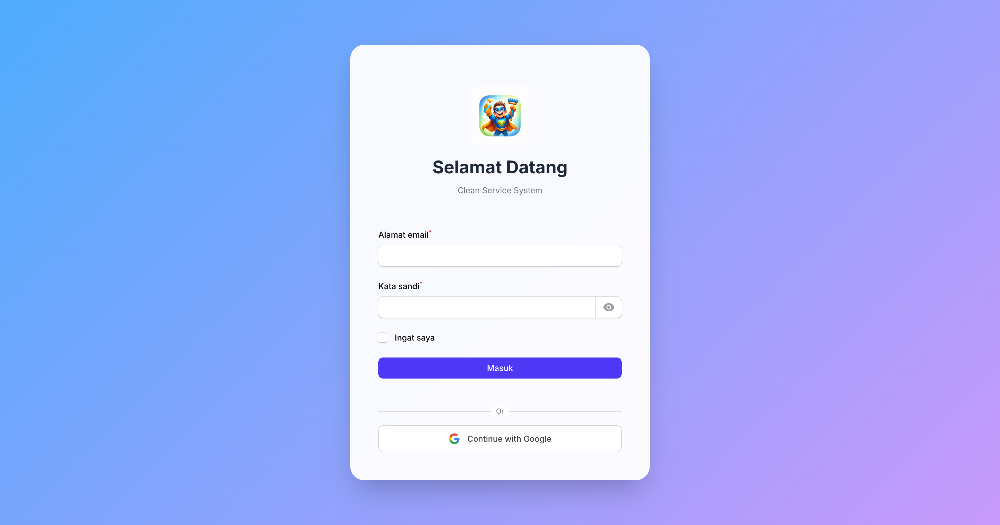

---

## 2. Tujuan & Manfaat

### Tujuan Utama
- Digitalisasi laporan kegiatan kebersihan
- Akuntabilitas dengan bukti foto ber-watermark
- Monitoring real-time terhadap kinerja petugas
- Pelayanan keluhan tamu yang terintegrasi
- Pelaporan bulanan otomatis untuk manajemen

### Manfaat
- Transparansi & efisiensi operasional
- Data yang dapat dipertanggungjawabkan
- Respon cepat terhadap keluhan tamu
- Kemudahan audit dan evaluasi

*Screenshot: Dashboard Utama*

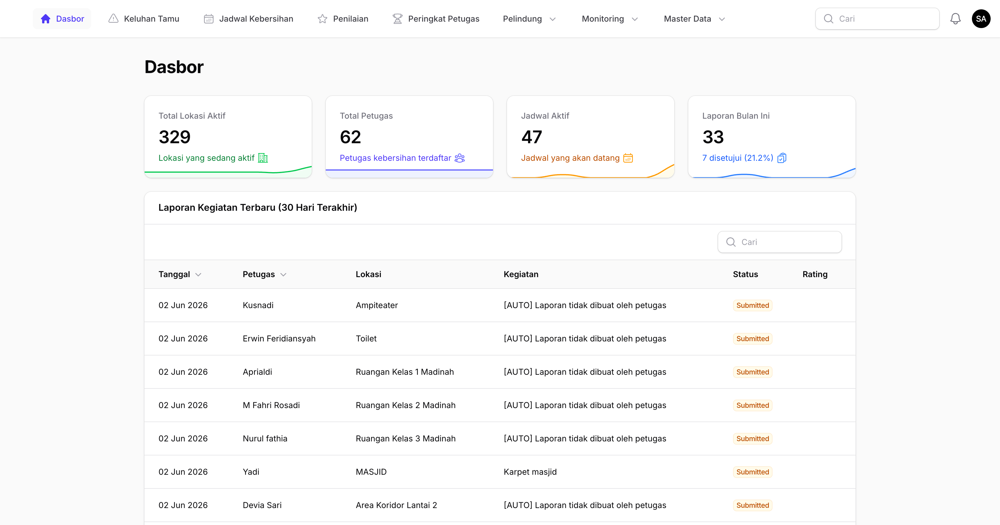

---

## 3. Teknologi yang Digunakan

| Komponen | Teknologi |
|----------|-----------|
| Backend | Laravel + Filament v3 |
| Database | PostgreSQL (Produksi) / MySQL (Dev) |
| Cache & Queue | Redis |
| Web Server | Nginx |
| Frontend Interaktif | Livewire + Alpine.js |
| Mobile (rencana) | React Native |
| Notifikasi | WhatsApp (WatZap, Twilio) |
| Hosting | VPS — css.kopkaryapi.id |

---

## 4. Riwayat Pengembangan (Berdasarkan Bulan Push ke GitHub)

### November 2025 — Fondasi Aplikasi

Pada bulan ini fokus pengembangan adalah membangun pondasi aplikasi.

- Inisialisasi project Laravel + Filament
- Dokumentasi awal project
- Fitur **GPS-enabled Watermark Camera** untuk Activity Reports
- Halaman **View Activity Report** untuk semua role

*Screenshot: Halaman Activity Report*

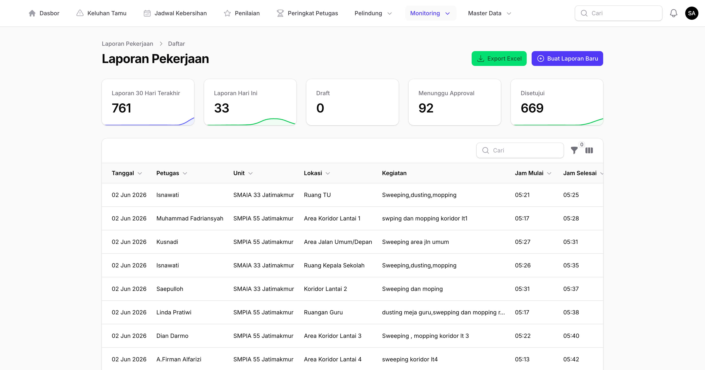

---

### Desember 2025 — Persiapan Produksi & Fitur Inti

Bulan ini fokus pada deployment ke produksi sekaligus melengkapi fitur utama.

- Setup produksi (Nginx + PostgreSQL + Redis)
- Deploy ke domain **eclean.adilabs.id**
- Modul **Unit Management**
- Modul **Guest Complaint System**
- **QR Code** otomatis untuk setiap Lokasi
- **Notifikasi WhatsApp** (Fonnte → WatZap)
- Rebranding **Clean Service System** beserta logo baru
- Dukungan **multiple photos** (maksimal 5) per laporan
- Status pelaporan: **On-Time / Late / Expired**
- Reorganisasi navigasi: grup **Master Data** & **Monitoring**

*Screenshot: QR Code Generator & Print Page*

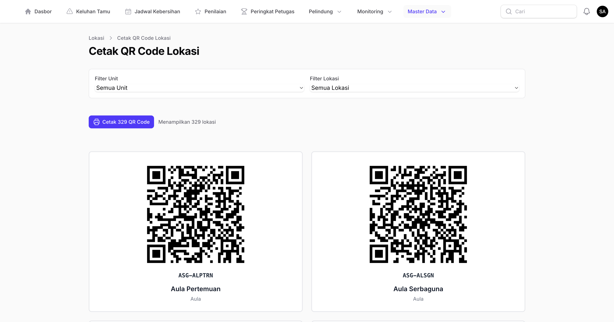

*Screenshot: Halaman Guest Complaint*

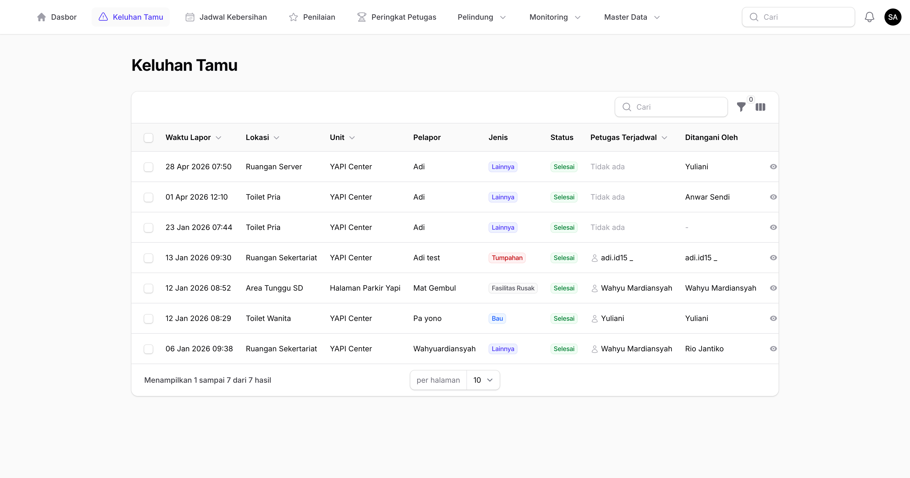

---

### Januari 2026 — Stabilisasi & Integrasi

Bulan ini fokus pada mempererat integrasi antar modul.

- Perbaikan **timezone** & pesan dashboard
- Script deploy otomatis dengan cache clearing
- Fitur **Camera Selection** & **Timer** pada watermark camera
- Integrasi **Guest Complaint ↔ Activity Report**
- Auto-assign keluhan tamu ke petugas yang sedang dijadwalkan
- Auto-update status keluhan tamu berdasarkan laporan kegiatan
- Infolist view Guest Complaint dengan foto bukti dari Activity Report
- Field wajib ditandai asterisk merah pada form Filament
- Perbaikan Google OAuth yang diblokir Service Worker (PNA)

*Screenshot: Form Activity Report dengan Guest Complaint*

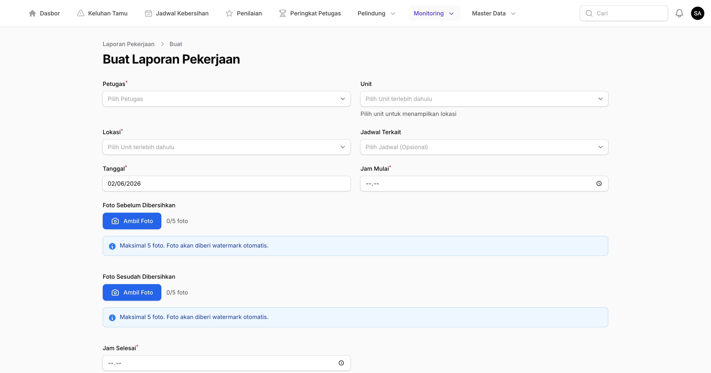

---

### Februari 2026 — Pelaporan Bulanan & Penyederhanaan

Bulan ini berorientasi pada kebutuhan manajemen akan laporan yang rapi.

- Halaman **Laporan Bulanan** dengan Export PDF
- Widget **Supervisor Monthly Report** di dashboard
- Filter pencarian (searchable) + logika dependent petugas-unit
- Layout print-friendly untuk PDF
- **GPS dihilangkan** dari kamera — lokasi diambil dari dropdown
- Tampilan PDF yang lebih rapi & informatif

*Screenshot: Halaman Laporan Bulanan*

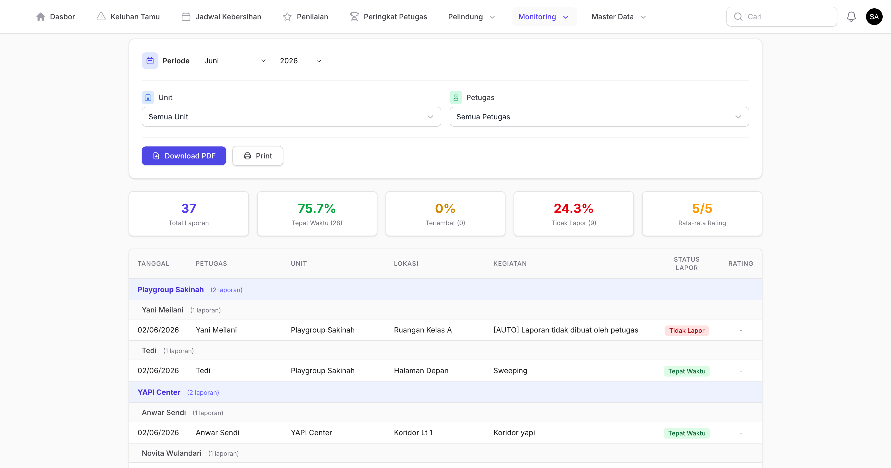

*Screenshot: Hasil PDF Laporan Bulanan*

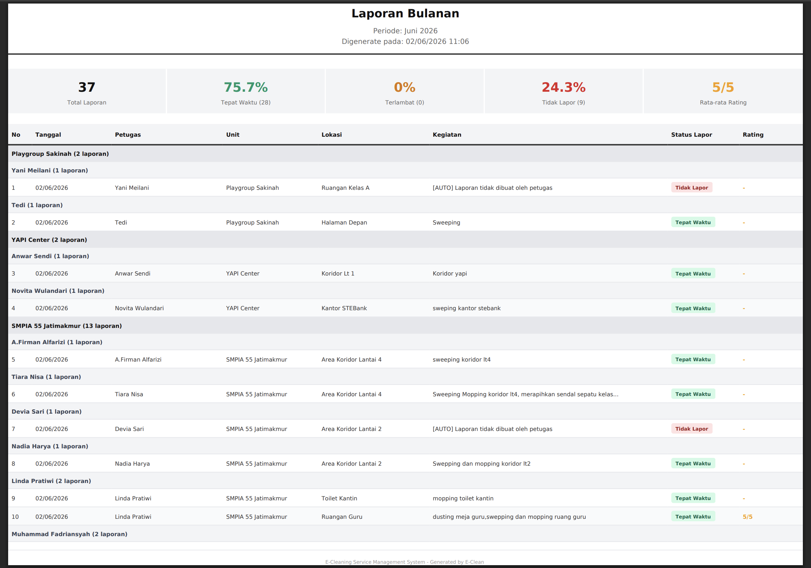

---

### Maret 2026 — Stabilisasi Besar & Testing

Bulan ini fokus pada kualitas, keandalan, dan kesiapan produksi.

- Perbaikan **13+ bug** sekaligus dalam satu siklus rilis
- Penambahan shift **Standby** & **Sweeping**
- Penambahan **131 unit test**
- Penghapusan 42 dokumen yang tidak digunakan (pembersihan repository)
- Script **`update.sh`** untuk update produksi
- Kompatibilitas migrasi shift untuk **PostgreSQL**
- Perbaikan tombol Cancel yang tidak sengaja men-submit form

*Screenshot: Manajemen Jadwal Kebersihan (dengan Shift Baru)*

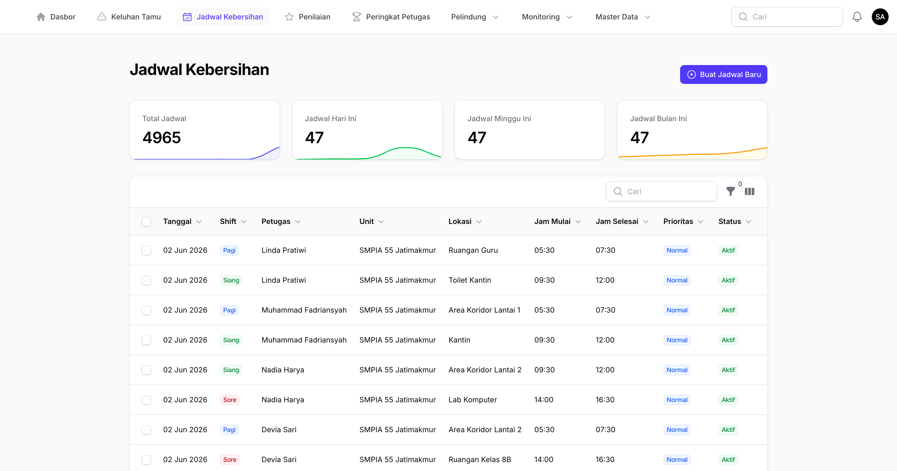

---

### April 2026 — Pembatasan Data & Provider Baru

Bulan ini berorientasi pada peningkatan performa dan fleksibilitas notifikasi.

- Filter **Unit** pada Jadwal Kebersihan
- Dashboard reports dibatasi **30 hari** terakhir
- Provider WhatsApp **Twilio** ditambahkan sebagai alternatif
- Resource data dibatasi 30 hari untuk role **Supervisor / Petugas / Pengurus**

**Hasil:** Aplikasi terasa lebih cepat, data lebih relevan dengan kebutuhan harian, serta pilihan provider notifikasi lebih luas.

*Screenshot: Dashboard Setelah Pembatasan 30 Hari*

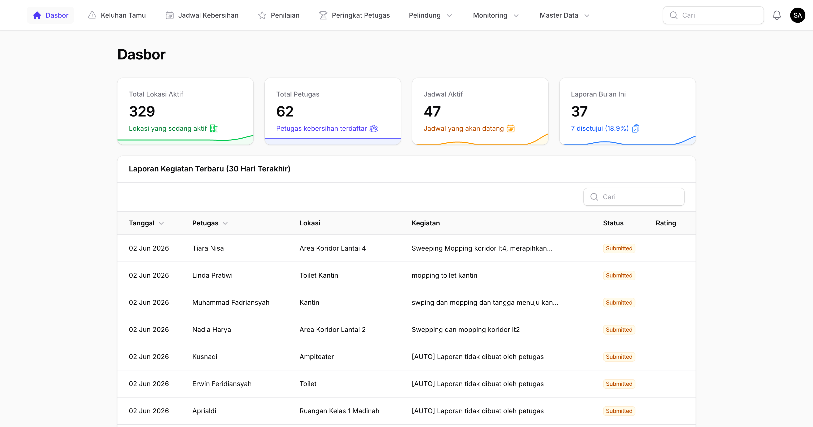

---

## 5. Rencana Pengembangan Mendatang

### Ekspansi Modul Petugas Lapangan

Aplikasi akan diperluas dari modul kebersihan menjadi **platform manajemen petugas lapangan multi-peran**. Tiga modul baru akan ditambahkan dengan pondasi yang sama (QR Code, watermark camera, jadwal, dan notifikasi WhatsApp).

#### Modul Satpam / Security
- **Patroli berbasis QR Code** — petugas keamanan men-scan QR pada setiap pos patroli sebagai bukti kehadiran.
- **Jadwal patroli per shift** (pagi, siang, malam) dengan rotasi otomatis.
- **Laporan kejadian (incident report)** — pencatatan kejadian dengan foto, lokasi, dan tingkat severity.
- **Log buku tamu digital** — pencatatan tamu masuk/keluar dengan foto identitas.
- **Notifikasi WhatsApp** otomatis ke supervisor jika ada incident atau pos patroli terlewat.
- **Tombol panic / SOS** dengan kirim lokasi real-time.

#### Modul Petugas Toko
- **Absensi shift** dengan QR Code di lokasi toko.
- **Laporan harian operasional toko** — pembukaan, penutupan, stok, dan kondisi area.
- **Checklist tugas harian** (display produk, kebersihan area, restocking).
- **Pelaporan keluhan pelanggan** dengan foto bukti.
- **Hand-over shift** antar petugas dengan catatan tertulis dan tanda tangan digital.
- **Laporan kasir / serah-terima** sederhana untuk akhir shift.

#### Modul Office Boy
- **Jadwal tugas harian** per ruangan / area kantor (pantry, ruang rapat, lobi, toilet).
- **Permintaan kebutuhan ruang rapat** dari karyawan (minuman, snack, set-up ruang) terintegrasi dengan tugas OB.
- **Checklist kebersihan & kerapihan** setiap area dengan foto sebelum/sesudah.
- **Pengantaran dokumen / paket internal** dengan tanda terima digital.
- **Permintaan ad-hoc** dari karyawan via aplikasi (request driven).
- **Statistik beban kerja** per Office Boy untuk pemerataan tugas.

#### Penyesuaian Sistem
- **Role baru:** `security`, `petugas_toko`, `office_boy` lengkap dengan permission per modul.
- **Dashboard khusus** per role dengan widget yang relevan.
- **Master Data** tambahan: Pos Patroli, Toko, Area Kantor.
- **Laporan bulanan multi-modul** untuk manajemen.

### Mobile App (React Native)
Aplikasi mobile native untuk seluruh role petugas — laporan kegiatan, push notification, dan dukungan offline-first.

*Screenshot: Mockup Mobile App*

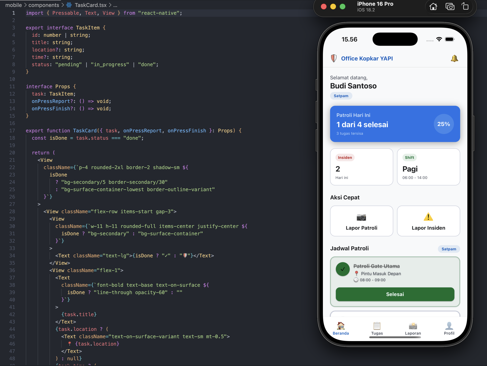

### Notifikasi Lanjutan
- Multi-provider WhatsApp dengan **failover otomatis** (WatZap/Twilio/Fonnte)
- Channel tambahan: **Email** & **In-app notification**

### Dashboard & Analitik
- Dashboard analitik tingkat **manajemen** dengan tren bulanan & per-unit
- Indikator **KPI petugas** (on-time rate, jumlah keluhan tertangani)

### Keamanan
- **2FA / OTP login** opsional
- **Audit log** aktivitas pengguna
- Role & permission yang lebih granular

### Performa & Operasional
- **Queue worker** untuk pemrosesan foto & notifikasi
- Penyimpanan foto ke **S3-compatible object storage**
- Image compression otomatis sebelum upload

### Pelaporan
- Export tambahan: **Excel** dan **CSV**
- Filter lanjutan: rentang tanggal bebas, multi-unit, multi-petugas

### Kualitas Kode
- **Feature test** untuk Filament resource
- Integrasi **CI/CD GitHub Actions**
- Static analysis dengan **PHPStan / Larastan**

---

## 6. Ringkasan Timeline

| Bulan | Tema | Pencapaian Utama |
|-------|------|------------------|
| November 2025 | Fondasi | Inisialisasi project + Watermark Camera |
| Desember 2025 | Go-Live | Produksi, Unit, Guest Complaint, QR Code |
| Januari 2026 | Integrasi | Guest Complaint ↔ Activity Report |
| Februari 2026 | Pelaporan | Laporan Bulanan PDF |
| Maret 2026 | Stabilisasi | 13+ bugfix, 131 unit test, PostgreSQL |
| April 2026 | Optimasi | Data 30 hari |
| Mendatang | Ekspansi | Modul Security / Petugas Toko / Office Boy, Mobile App, Analitik, CI/CD, WhatsApp |

---

## Penutup

**Clean Service System (E-Clean)** terus dikembangkan secara iteratif dengan mengikuti kebutuhan nyata di lapangan. Setiap bulan membawa peningkatan kualitas, baik dari sisi fitur, performa, maupun kestabilan.

Website: https://css.kopkaryapi.id

---
