# Laporan Update Aplikasi — Apps KopkarYAPI **v2**

> Pembaruan besar: tampilan lama (panel admin Filament yang berat) digantikan
> **aplikasi PWA modern** yang ringan, bisa dipasang di HP, jalan walau offline,
> dan punya **dashboard khusus untuk tiap jenis petugas** (Kebersihan, Satpam,
> Office Boy, Toko).

---

## 1. Ringkasan Pembaruan

| Aspek | Versi Lama | **v2 (Baru)** |
|---|---|---|
| Tampilan | Panel web Filament (berat di HP) | **PWA Next.js** — ringan, cepat, mobile-first |
| Pemasangan | Buka lewat browser | **Bisa di-install ke layar utama** (seperti aplikasi) |
| Koneksi | Wajib online | **Bisa offline** — laporan tersimpan & otomatis terkirim saat online |
| Notifikasi | Tidak ada | **Notifikasi push** (laporan disetujui/ditolak) |
| Jenis petugas | Hanya kebersihan | **4 jenis: Kebersihan, Satpam, Office Boy, Toko** |
| Foto laporan | Ukuran besar | **Dikompres otomatis** (hemat kuota, upload cepat) |
| Saat refresh | Memuat ulang semua | **Instan** (aset tersimpan di perangkat) |

---

## 2. Fitur Baru v2

### A. Aplikasi untuk Petugas (Kebersihan, Satpam, Office Boy, Toko)
- **Dashboard per jenis petugas** — tiap petugas hanya melihat jadwal & laporan miliknya.
- **Form laporan khusus tiap jenis:**
  - **Kebersihan** — kegiatan + foto sebelum & sesudah.
  - **Satpam** — kondisi (aman/perhatian/bahaya), temuan, tindakan, foto.
  - **Office Boy** — jenis pekerjaan, uraian, foto sebelum & sesudah.
  - **Toko** — kondisi stok, catatan, foto.
- **Jadwal** hari ini & mendatang.
- **Riwayat laporan** lengkap dengan status (menunggu/disetujui/ditolak).
- **Penilaian** kinerja petugas.

### B. Mode Offline + Sinkronisasi Otomatis
- Petugas di area sinyal lemah tetap bisa **submit laporan tanpa internet**.
- Laporan tersimpan aman di HP, lalu **terkirim otomatis** begitu online.
- Indikator status sinkronisasi yang jelas.

<br>

### C. Notifikasi Push
- Petugas menerima **pemberitahuan langsung** saat laporannya disetujui/ditolak supervisor.
- Bisa diaktif/nonaktifkan dari menu Profil.

### D. Dashboard Supervisor
- **Kotak masuk review** menggabungkan laporan dari semua jenis petugas.
- **Setujui / Tolak** laporan + beri nilai & catatan, langsung dari HP.

### E. Panel Admin (Kelola Data)
- **Kelola Lokasi** (tambah/edit/hapus).
- **Kelola Unit/Area.**
- **Tindak lanjut Keluhan Tamu** (proses → selesai/tolak).

### F. Penyempurnaan Umum
- **Login dengan Google** (selain email/sandi).
- **Tema baru (Claymorphism)** yang lembut & modern.
- **Pasang ke layar utama** (Android & iOS).
- **Notifikasi versi baru** otomatis saat ada update.

---

## 3. Alur Kerja (Workflow) Tiap Dashboard

**Alur umum semua petugas:**

```
Login → Lihat Jadwal hari ini → Kerjakan tugas → Buat Laporan + Foto
   → Kirim (tersimpan otomatis walau OFFLINE) → Tersinkron saat online
   → Supervisor meninjau (Setujui / Tolak) → Petugas dapat Notifikasi
```

### A. Dashboard Petugas Kebersihan
1. **Login** sebagai petugas kebersihan → **Beranda** menampilkan jumlah jadwal hari ini.
2. Buka **Jadwal** → pilih lokasi yang dijadwalkan (mis. *Toilet Lantai 1*).
3. Tekan **Buat Laporan**, isi:
   - **Kegiatan** (uraian pekerjaan kebersihan),
   - **Foto sebelum** & **Foto sesudah** (wajib),
   - Catatan (opsional).
4. **Kirim** → laporan berstatus **Menunggu**. Bila offline, otomatis tersimpan & terkirim saat online.
5. Supervisor **menyetujui/menolak** → petugas menerima **notifikasi** & status berubah di menu **Laporan**.

### B. Dashboard Satpam (Keamanan)
1. **Login** sebagai satpam → **Beranda**/**Jadwal** menampilkan jadwal patroli/shift hari ini.
2. Setelah patroli, tekan **Buat Laporan**, isi:
   - **Kondisi**: *Aman / Perhatian / Bahaya*,
   - **Temuan** (mis. pintu tidak terkunci) & **Tindakan** yang dilakukan,
   - **Foto** bukti (opsional).
3. **Kirim** → masuk antrian (aman walau offline) → ditinjau supervisor.
4. Bila kondisi **Bahaya/Perhatian**, supervisor bisa langsung menindaklanjuti dari dashboard-nya.

### C. Dashboard Office Boy (OB)
1. **Login** sebagai OB → lihat **Jadwal** tugas area (mis. *Ruang Rapat Lt.2*).
2. Tekan **Buat Laporan**, isi:
   - **Jenis pekerjaan** (mis. bersih ruang rapat, antar konsumsi),
   - **Uraian** pekerjaan,
   - **Foto sebelum** & **Foto sesudah** (opsional).
3. **Kirim** → ditinjau supervisor → notifikasi hasil.

### D. Dashboard Petugas Toko
1. **Login** sebagai petugas toko → lihat **Jadwal** & lokasi toko.
2. Tekan **Buat Laporan**, isi:
   - **Kondisi stok**: *Aman / Menipis / Kosong*,
   - **Catatan stok** (mis. barang yang perlu di-restock),
   - **Foto** rak/etalase (opsional).
3. **Kirim** → supervisor meninjau; informasi stok membantu pengambilan keputusan.

### E. Dashboard Supervisor (peninjau)
1. **Login** sebagai supervisor → **Beranda** menampilkan jumlah laporan menunggu review.
2. Buka **Review** → daftar laporan masuk **dari semua jenis petugas** (kebersihan/satpam/OB/toko) jadi satu.
3. Buka detail → lihat isi laporan + foto → **Setujui** (beri ⭐ nilai & catatan) atau **Tolak** (beri alasan).
4. Keputusan otomatis mengirim **notifikasi** ke petugas terkait.

> **Catatan:** keempat jenis petugas memakai aplikasi & navigasi yang sama; yang
> berbeda hanya **isi form laporan** sesuai bidangnya. Ini membuat pelatihan
> mudah dan satu aplikasi melayani semua peran.

---
<br>
<br>
<br>
<br>
<br>
<br>
<br>
<br>
<br>
<br>
<br>

## 4. Tangkapan Layar Aplikasi

### Halaman Petugas
| Login | Beranda | Jadwal |
|---|---|---|
| 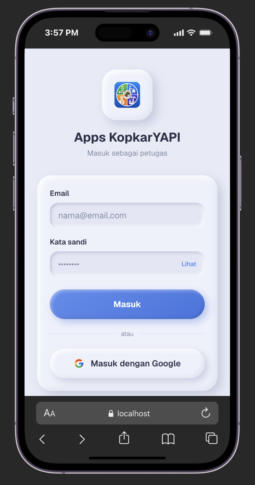 | 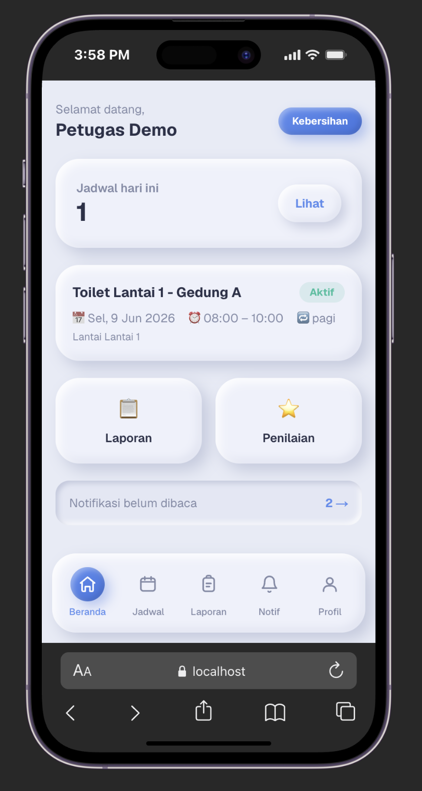 | 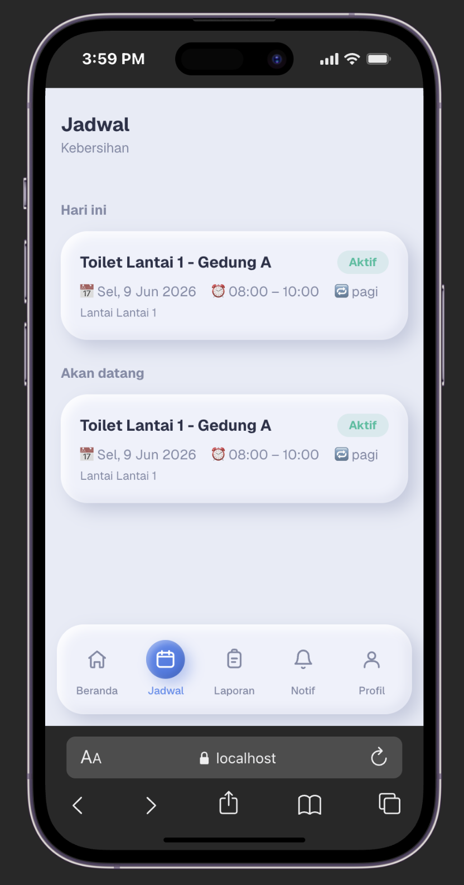 |

| Form Laporan Kebersihan | Form Laporan Satpam | Form Laporan Office Boy |
|---|---|---|
| 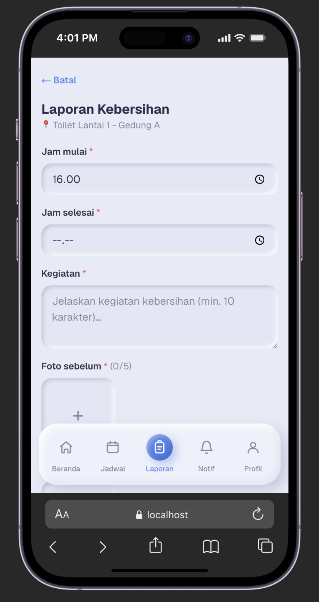 | 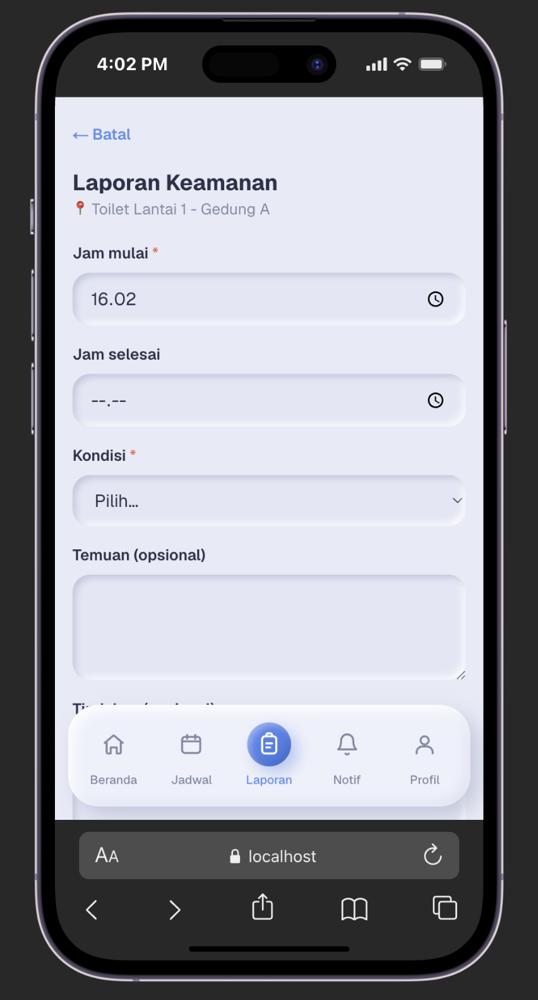 | 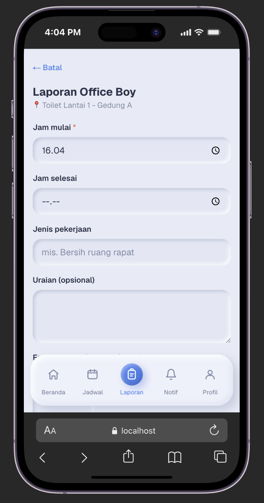 |

| Notifikasi | Penilaian | Profil |
|---|---|---|
| 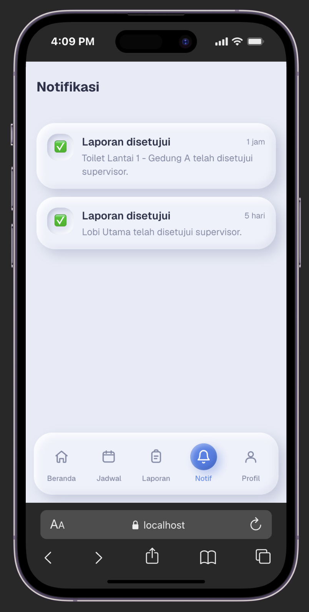 | 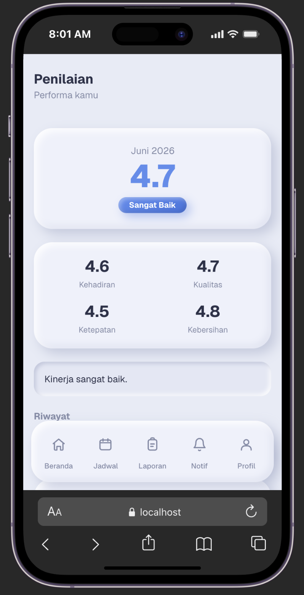 | 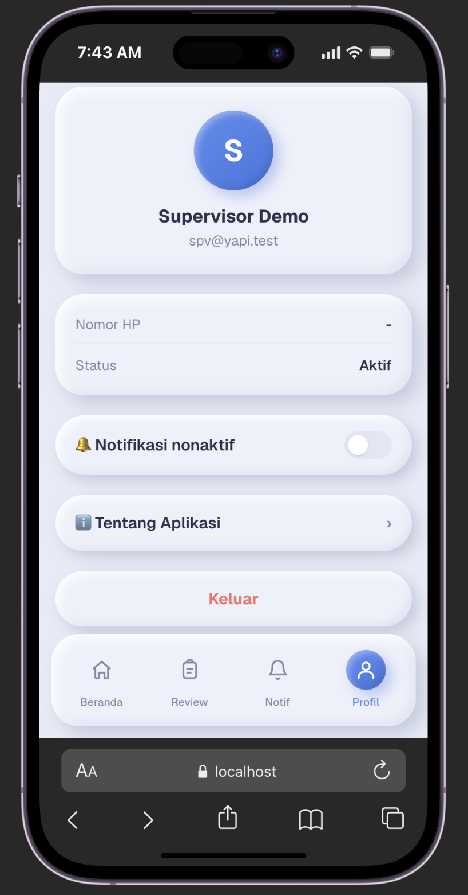 |

### Halaman Supervisor
| Beranda Supervisor | Kotak Masuk Review | Detail + Approve/Tolak |
|---|---|---|
| 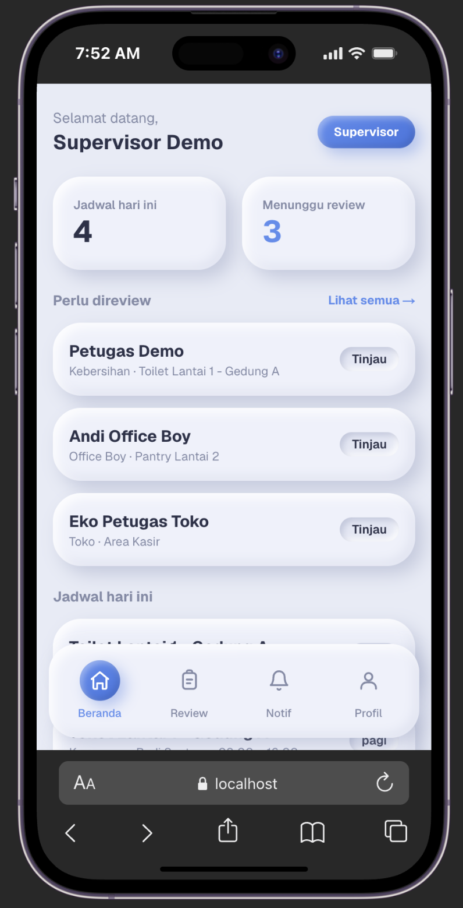 | 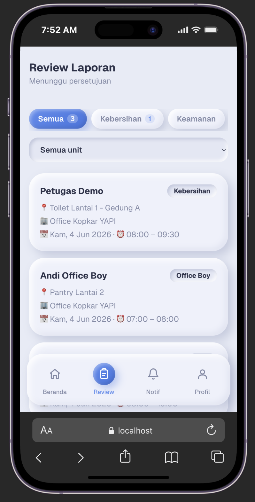 | 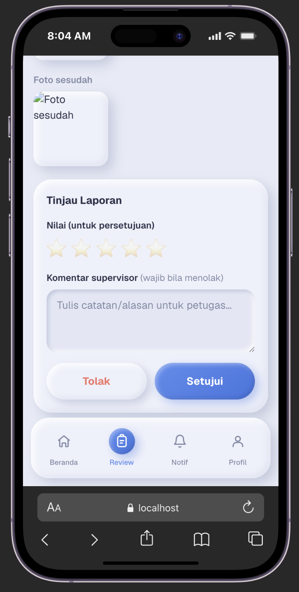 |

---

## 5. Harga Update Aplikasi

> **Catatan:** angka di bawah adalah **biaya** berdasarkan cakupan pekerjaan v2.

| No | Modul / Pekerjaan | Biaya |
|---:|---|---:|
| 1 | Fondasi aplikasi PWA (arsitektur, login, tema, pemasangan ke HP) | Rp 1.500.000 |
| 2 | Modul petugas multi-jenis (Kebersihan, Satpam, Office Boy, Toko) — jadwal, form laporan, riwayat, penilaian | Rp 1.500.000 |
| 3 | Mode offline + sinkronisasi otomatis + kompresi foto | Rp 1.250.000 |
| 4 | Notifikasi push (Web Push) | Rp 550.000 |
| 5 | Dashboard Supervisor (review approve/tolak lintas jenis) | Rp 1.250.000 |
| 6 | Panel Admin (kelola lokasi, unit, keluhan tamu) | Rp 1.250.000 |
| 7 | Integrasi backend, pengujian, & deployment | Rp 200.000 |
| | **Total Biaya** |**Rp 7.500.000** |

---

<br>
<br>
<br>
<br>
<br>
<br>
<br>
<br>
<br>
<br>
<br>
<br>
<br>
<br>
<br>
<br>
<br>
<br>
<br>
<br>
<br>
<br>
<br>
<br>
<br>
<br>

## 6. Invoice

<table width="100%" style="border-collapse:collapse;font-size:14px;margin-bottom:16px;">
  <tr>
    <td style="vertical-align:top;width:50%;">
      <div style="font-size:20px;font-weight:bold;letter-spacing:1px;">INVOICE</div>
      No. Invoice : INV-KYAPI/V2/2026-001<br/>
      Tanggal : 10 Juni 2026
    </td>
    <td style="vertical-align:top;width:50%;text-align:right;">
      <strong>Ditagihkan kepada:</strong><br/>
      Koperasi Karyawan YAPI (KopkarYAPI)<br/>
      Untuk: Pengembangan <strong>Apps KopkarYAPI v2</strong>
    </td>
  </tr>
</table>

<table width="100%" style="border-collapse:collapse;font-size:14px;">
  <thead>
    <tr style="background:#eef1fb;">
      <th style="border:1px solid #cdd3e0;padding:10px;text-align:center;width:48px;">No</th>
      <th style="border:1px solid #cdd3e0;padding:10px;text-align:left;">Deskripsi</th>
      <th style="border:1px solid #cdd3e0;padding:10px;text-align:right;width:160px;">Jumlah</th>
    </tr>
  </thead>
  <tbody>
    <tr>
      <td style="border:1px solid #cdd3e0;padding:10px;text-align:center;">1</td>
      <td style="border:1px solid #cdd3e0;padding:10px;">Pengembangan Aplikasi Apps KopkarYAPI v2 (sesuai rincian Bagian 5)</td>
      <td style="border:1px solid #cdd3e0;padding:10px;text-align:right;">Rp 7.500.000</td>
    </tr>
    <tr>
      <td colspan="2" style="border:1px solid #cdd3e0;padding:10px;text-align:right;">Subtotal</td>
      <td style="border:1px solid #cdd3e0;padding:10px;text-align:right;">Rp 7.500.000</td>
    </tr>
    <tr style="background:#eef1fb;">
      <td colspan="2" style="border:1px solid #cdd3e0;padding:10px;text-align:right;font-weight:bold;">TOTAL TAGIHAN</td>
      <td style="border:1px solid #cdd3e0;padding:10px;text-align:right;font-weight:bold;">Rp 7.500.000</td>
    </tr>
  </tbody>
</table>

<p style="font-size:14px;margin-top:8px;"><em>Terbilang: <strong>tujuh juta lima ratus ribu rupiah</strong>.</em></p>

<table width="100%" style="border-collapse:collapse;font-size:14px;margin-top:8px;">
  <tr>
    <td style="width:50%;vertical-align:top;">
      <strong>Pembayaran ke:</strong><br/>
      Bank / E-Wallet : BNI<br/>
      No. Rekening&nbsp;&nbsp;&nbsp; : 1962638260<br/>
      Atas Nama&nbsp;&nbsp;&nbsp;&nbsp;&nbsp; : Adi Sumardi
    </td>
    <td style="width:50%;vertical-align:top;">
    </td>
  </tr>
</table>

<br/>

<table width="100%" style="border:none;border-collapse:collapse;text-align:center;font-size:14px;margin-top:24px;">
  <tr>
    <td style="border:none;width:50%;">Dibuat oleh,<br/><strong>Developer</strong></td>
    <td style="border:none;width:50%;">Menyetujui,<br/><strong>Pengawas Koperasi</strong></td>
  </tr>
  <tr>
    <td style="border:none;height:110px;"></td>
    <td style="border:none;height:110px;"></td>
  </tr>
  <tr>
    <td style="border:none;">Adi Sumardi, S.Pd</td>
    <td style="border:none;">Prof. Dr. H. Otib Satibi H, M.Pd</td>
  </tr>
</table>

---

<br>
<br>
<br>
<br>
<br>
<br>
<br>
<br>
<br>
<br>
<br>
<br>
<br>

## 7. Rekomendasi Tablet untuk Supervisor

Tablet ini **hanya dipakai supervisor** untuk **meninjau (review) & menyetujui
laporan** — bukan untuk mengambil foto di lapangan. Karena itu kebutuhannya
ringan, dan tablet **di bawah Rp 3 juta sudah lebih dari cukup**.

**Spesifikasi yang diperlukan (ringan):**
- Android **10 ke atas** dengan **Chrome** (agar PWA & notifikasi jalan)
- RAM **4 GB**, penyimpanan **64 GB+**
- **Layar cukup besar & jernih** (8"–11") untuk melihat foto laporan
- **Wi‑Fi sudah cukup** bila supervisor bekerja di kantor (tidak wajib LTE)
- Kamera & GPS **tidak diperlukan** (supervisor tidak memotret di lapangan)

### Perbandingan (semua di bawah Rp 3 juta)

| Kriteria | **Samsung Galaxy Tab A9+** | **Lenovo Tab M11** | **Samsung Galaxy Tab A9** |
|---|:--:|:--:|:--:|
| Foto |  |  |  |
| Layar | **11"** 90Hz | **11"** 90Hz | 8,7" |
| RAM / Penyimpanan | 4 / 64 GB | 4 / 128 GB | 4 / 64 GB |
| Jaringan | Wi‑Fi | Wi‑Fi / **LTE** | Wi‑Fi |
| Android | 13/14 (One UI) | 13/14 | 13/14 (One UI) |
| Baterai | 7.040 mAh | 7.700 mAh | 5.100 mAh |
| Harga (Juni 2026)* | **Rp 2.799.000** | **Rp 2.616.000** | **Rp 1.999.000** |
| Catatan | Layar besar + brand awet | Layar besar + ada LTE | Paling murah, ringkas |

<sub>*Harga riil pasar Indonesia per **Juni 2026** (sumber: Samsung Indonesia / Plaza IT, Lenovo / Tokopedia) — dapat berubah mengikuti promo, stok, & toko. Harga di atas untuk varian **Wi‑Fi** (Lenovo M11 ada opsi LTE).</sub>

### Ringkasan pilihan
- **Rekomendasi utama (layar besar):** Samsung Galaxy Tab A9+ Wi‑Fi — layar 11" paling nyaman untuk melihat foto laporan, brand awet & after‑sales luas.
- **Butuh layar besar + bisa internet sendiri (LTE):** Lenovo Tab M11.
- **Paling hemat:** Samsung Galaxy Tab A9 (8,7") — cukup untuk review walau layar lebih kecil.

> **Alternatif non‑Samsung yang lebih murah:** **Xiaomi Redmi Pad SE 8.7** (4/128) ± **Rp 1.760.000**.

> **Saran:** untuk supervisor, **Samsung Galaxy Tab A9+ Wi‑Fi (Rp 2.799.000)** adalah
> pilihan paling pas — layar 11" jernih untuk meninjau foto, lancar, dan harganya
> tetap di bawah Rp 3 juta. Wi‑Fi kantor sudah cukup; tidak perlu varian LTE.

---

*Dokumen ini dibuat untuk laporan pembaruan **Apps KopkarYAPI v2** · https://kopkaryapi.id*
